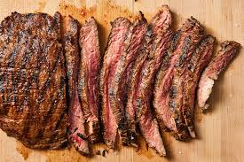

## JavaScript
1. **Variable Naming & Indentation**
``` 
let item1 = document.getElementById('i0')
let item2 = document.getElementById('i1')
let item3 = document.getElementById('i2')
let item4 = document.getElementById('i3')
let item5 = document.getElementById('i4')
```
2. **Function Naming & Modularity**
```
function names() { //saves name after it gets hatched
    let e = window.prompt("What do you want to name your pet?");
    if (e === null || e === "") {
        alert("Please enter a name for your pet.");
        names();
    } else {
        alert("Your pet's name is " + e + "!");
        console.log(e);
        localStorage.setItem("petName", e);
        localStorage.setItem("petType", chosenPet); // Save the image filename
        nam.innerHTML = `${e}`;
        start()
    }
```
The function name() allows you to  name your pet

3. **Arrays & Objects Usage**
```
let pets = [
    "images/Porcupine-fish-Diodon-hystox.webp",
    "images/bat.jfif",
    "images/beetle.jfif",
    "images/cat.jfif",
    "images/crab.jpg",
    "images/man.jpg",
    "images/racoon.jfif",
    "images/walrus.jfif"
];
```
An array of images

4. **Array Methods (map, filter, reduce, etc.)**

```
if (itemName.includes(searchTerm)) {
            item.style.display = 'block'
        } else {
            item.style.display = 'none'
        }
```
.includes to search through an array of itemName using searchTerm

5.  **Looping/Iteration through arrays/objects**
```
for(let i=1; i<=carrot; i++){
        inv.innerHTML += `<div class="item" id='carrot${i}' onclick='carro(${i})'>
    <h3>Carrot</h3> <br>
    <hr>  
    <p>-1 hunger</p>
    </div>`
    }
```
carrot is an object and you're just looping through it to create a bunch of divs 

6. **Web Storage (localStorage/sessionStorage)**
```
let steak = localStorage.getItem('steak')

localStorage.setItem('steak', steak)
```
LocalStorage is used for all if not most stuff in this code

7. **Saving/Retrieving User Data**
```
let age = parseFloat(localStorage.getItem('age'))||0
```
age is used to show how many minutes the user has spent in the game

8. **DOM Manipulation**
```
inv.innerHTML += `<div class="item" id='steak${steak}' onclick='stea(${steak})'>
    <h3>Steak</h3> <br>
    <hr>  
    <p>-100 hunger</p>
     </div>`
    }
```
.innerHTML to add a div

9. **CSS Manipulation via JS**
```
item.style.display = 'block'
```
this affects how the item is displayed through CSS manipulation

10. **Theme Preference**
```
let ld = document.getElementById('ld');
let isLight = localStorage.getItem("isLight") === "true"; // get as boolean

ld.addEventListener('click', function () { //function for light/dark mode
    isLight = !isLight; // Flip the mode
    localStorage.setItem('isLight', isLight);
    document.getElementById('pet-status').classList.toggle('lightMode');
    document.getElementById('pet-status').classList.toggle('darkMode');

    document.getElementById('pet-actions').classList.toggle('lightMode');
    document.getElementById('pet-actions').classList.toggle('darkMode');

    document.getElementById('head').classList.toggle('lightMode');
    document.getElementById('head').classList.toggle('darkMode');

    document.getElementById('pet-image').classList.toggle('lMid');
    document.getElementById('pet-image').classList.toggle('dMid');
});


```
This changes all the divs(that need to be changed) to either light or dark mode

11. **Comments & Readablity**
```
let isLight = localStorage.getItem("isLight") === "true"; // get as boolean
```
Comments help figure out what stuff is doing

12.  **Error Handling**
```
function carro(e){
    //this is what happens when you click on the carrot from the inventory
    console.log('worked')
}
```
Console.log() to make sure that clicking on it works

13. **Timer**
```
let ageText = document.getElementById('age')
        let age = parseFloat(localStorage.getItem('age'))||0
        ageText.innerHTML = age
        setInterval(() => {
        
            if(localStorage.getItem('hatched') =="true"){
                 console.log("Hatched");
            age+=1
            console.log(age)
            ageText.innerHTML = age
            localStorage.setItem("age", age)
            if(age == 1){
                window.alert("Congrats on a year old pet (or one minute in the game)")
            }
            if(age == 5){
                window.alert("your pet has lived for 5 years!")
            }
        }
},60000)
```
every minute age increases by one

14. **Math, String, Random methods**
```
let chosenPet = pets[Math.floor(Math.random() * pets.length)];
```
Math.random to choose a random bet from an array

15. **Event Listeners & Keyboard Shortcuts**
```
document.addEventListener('keypress', function(e){
    if(pet.style.position === 'relative'){
    if(e.key ==="w"){
        if(t >= -35){
        t--
        p.style.top =`${t}%`
        console.log(t)
        }
   }
```
EventListener to move animal with certain keys as movement

16. **Real-time Search**

```
 searchbar2.addEventListener('input', function () {
    const searchTerm = searchbar2.value.toLowerCase()
    const items = document.querySelectorAll('#inv .item')

    items.forEach(item => {
        const itemName = item.querySelector('h3').textContent.toLowerCase()
        if (itemName.includes(searchTerm)) {
            item.style.display = 'block'
        } else {
            item.style.display = 'none'
        }
    })
})
```
Everytime an input is in the search it activates and searches through json array

17. **Regex** 
```
 let Letterpattern =/[a-zA-Z]+/
function names() { //saves name after it gets hatched
    let e = window.prompt("What do you want to name your pet?");
    if (!Letterpattern.test(e)) {
        alert("Name must contain atleast one letter");
```
18. **Cookies with expiry**
```
 let day = fullTime.getDate()
    let month = fullTime.getMonth()
    let year = fullTime.getFullYear()
    console.log("Current", `${month+1}/${day}/${year}`)
    document.cookie = `current=${month+1}/${day}/${year}; expires= ${month}/${day+5}/${year}` <---
    let current = getCookie("current")
    console.log("cookie time",current)
    let startDate = getCookie("current") || `${month}/${day}/${year}`
    document.getElementById('startDate').innerText = startDate
```
19. **Timer and date**
```
let fullTime = new Date()
let day = fullTime.getDate()
let month = fullTime.getMonth()
let year = fullTime.getFullYear()
```
20. **Modular File Structure**
```
    <script src="js/script.js"></script>
    <script src="js/age.js"></script>
    <script src="js/stats.js"></script>
    <script src="js/shop.js"></script>
    <script src="js/search.js"></script>
    <script src="js/movement.js"></script>
```